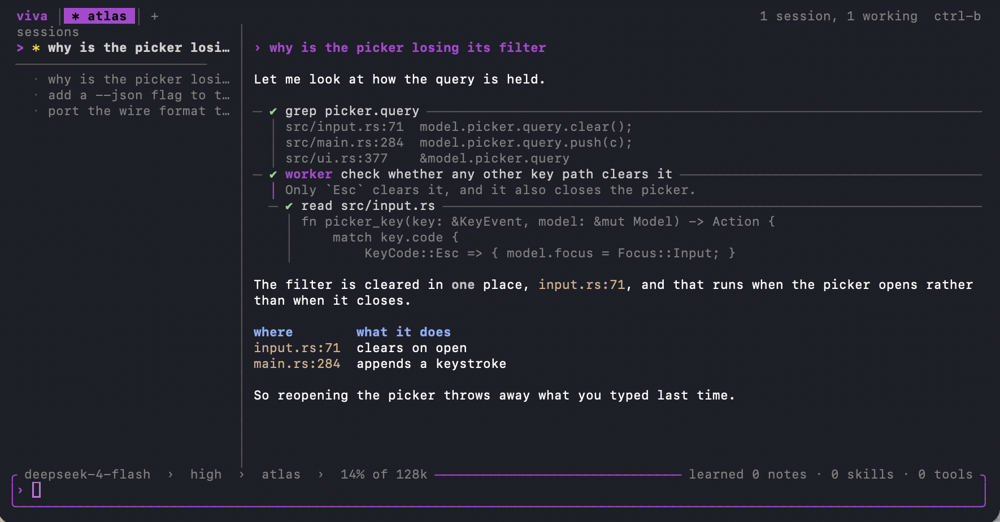

# viva

**Your agent's work should not end because you closed a terminal.**

viva runs sessions in a daemon and writes down what it learns. Close the lid,
drop the network, restart the daemon — reattach and the conversation is still
there, under the same id. One machine holds hundreds of them at once, and each
session can spawn subagents that cannot outlive it.



- Close the terminal and the turn keeps going.
- Restart the daemon and every session comes back, under the same id.
- 200 sessions share 20 MB of heap and take one thread each.
- Search every session you have ever had, by its text.
- A session spawns scoped children that cannot outlive it.
- It keeps what it learns as files you can read and edit.

## Install

```bash
sh install.sh     # needs SBCL; installs Quicklisp if it is absent
viva              # opens this directory's session, or starts one
```

Or take one file. CI builds `viva-macos-arm64` and `viva-linux-x86_64`, which
need neither SBCL nor Quicklisp.

### Windows

Run it under WSL. Both ends talk over a unix socket, and Windows has none, so
the daemon does not build there.

```powershell
wsl --install               # PowerShell, once, then reboot
```

```bash
git clone <this repo> ~/viva     # inside the Ubuntu shell
cd ~/viva && sh install.sh
```

Keep the checkout inside the WSL filesystem. A path under `/mnt/c/` sends every
file read across the Windows boundary. CI does not test WSL. It tests the Linux
build that WSL runs.

## Run

| command | what it does |
| --- | --- |
| `viva` | full screen: sessions, transcript, tasks |
| `viva attach` | line oriented, for pipes and diffs |
| `viva learned` | what this directory has retained |
| `viva sessions` | every recorded conversation here |
| `viva daemon status` | the long lived process |

Keys inside the full screen client. Press `/` for the commands.

| key | action |
| --- | --- |
| `Ctrl-P` | find any session, running or not; type to narrow |
| `Ctrl-N` | start a session in a new tab |
| `Ctrl-W` | close the tab; the session keeps running |
| `Ctrl-O` | show all of a tool's output, or the first three lines again |
| `Ctrl-L` | what this session has learned |
| `Ctrl-B` | put the sessions column away, or bring it back |
| `!` | run a shell command here; the model does not see it |
| `Ctrl-C` | stop the running turn; leave when there is none |

## What survives what

Closing a client removes a subscriber. It does not end the work. If the daemon
goes away, the client reconnects by itself and reads the session again.

| event | the session | the turn that was running |
| --- | --- | --- |
| client closed or crashed | keeps running | keeps running |
| lid closed | pauses with the machine | resumes with the machine |
| daemon stopped or killed | comes back, same id | lost; the session says so |
| `session.stop` | ends | ends |

A turn is a thread in the daemon. When the daemon dies, the turn dies with it,
and the transcript holds everything up to the last message written.

## What it keeps, and where

| tier | written to | reaches the model as |
| --- | --- | --- |
| note | `MEMORY.md` | prompt text |
| skill | `.vivarium/skills/<name>/SKILL.md` | prompt text |
| tool | `.vivarium/tools/<name>/tool.json` | the tool list, and MCP |

A fact becomes a note. Code becomes a skill. Code the agent has already wanted
twice becomes a tool it calls by name. The agent writes these with the ordinary
`write` tool, and you can author one by hand in the same format. `~/.vivarium/`
applies to every directory, and the project directory wins on a name clash.

## Self-improvement experiments

The question the project exists to answer: **does an agent that edits its own
working environment beat one that re-derives the work each time?** Every
experiment is pre-registered before it runs, with its kill criterion fixed in
advance, so a result can lose.

- [x] **Retention on real work.** 25 tasks, five recurring job shapes, policy
  on. It retains, and what it retains is good: 5 artifacts, 4 of 5 worth
  keeping on a cold review. Later tasks called the one tool it built five
  times. [Results](experiments/dogfood/RESULTS.md).
- [x] **Does retention pay?** Not yet, and honestly split. The corpus improved
  8.2% against a 20% threshold, and one job shape got 18% worse. Averaging
  those into a win is the thing the threshold exists to prevent.
- [x] **Live self-modification** — compiling retained code into the running
  Lisp image, mid-task. Killed on the pre-registered rule. Carrying the door
  costs about 23% in tokens even when nothing opens it. The cleanest, most
  fluent use in the battery still cost 43% to 73% more.
  [Results](experiments/kc6/RESULTS.md).
- [x] **Will a model invest if you let it?** Not on its own. Across 45
  task-runs with the door open, every arm made zero `remember` calls and wrote
  no `MEMORY.md`. Re-running under explicit framing did not move it.
- [ ] **Composition** — does a capability that calls another capability beat a
  text skill re-derived each time? This needs both retention and live
  execution in one harness, which is why it is testable here.
  [Pre-registration](docs/b15-preregistration.md).
- [ ] **A Lisp-fluent model.** 19 of 59 self-modification attempts failed to
  compile, which measures the model rather than the mechanism. The current
  pin forbids the probe.
- [ ] **Ergonomics on the door** — shipping an idiom guide in the tool
  descriptions, since a door's ergonomics include its language.

What the record supports so far: **retention pays where the work is mechanical
and recurs, and costs where the work is judgment.** The round trip is the
expense, not the language. Short tasks have no derivation cost to amortise an
artifact against.

[docs/self-improvement-model.md](docs/self-improvement-model.md) states the
model behind them.

## Files

```
bin/vivarium         the launcher; `viva` links to it
src/core/            messages, tools, the agent loop
src/workspace/       skills, registry, memory, reflection
src/daemon/          sessions as actors, the socket, the task tree
src/tui/             the Lisp full screen client
tui/                 the Rust client, and three checks that drive it over a pty
spec/                TLA+ specifications and their configurations
experiments/         pre-registrations, runs, and results
tools/               the image build, and the checks that need a terminal
docs/                design decisions and comparisons
```

```bash
viva test                                   # the Lisp suite
cargo test --manifest-path tui/Cargo.toml   # the client
./spec/verify.sh                            # the TLA+ configurations
```

CI runs all three on macOS and Linux, builds a standalone binary on each, then
starts a daemon with the binary it built and asks it for its sessions. An
artifact that cannot serve fails the build. Eleven of the 23 TLA+
configurations must fail: a proof that stops proving breaks the run instead of
passing quietly.

## Acknowledgements

- The agent loop is a port of [Pi](https://github.com/badlogic/pi-mono).
  [docs/harness-lineage.md](docs/harness-lineage.md) names what came from Pi
  and what this project added.
- The skill format follows Anthropic's Agent Skills.
- The tool format follows MCP. `viva mcp` serves the registry to any client.
- The Rust client draws with [ratatui](https://ratatui.rs) and parses markdown
  with pulldown-cmark.
- The Lisp engine runs on SBCL.

## Status

A research harness, in use on its own development. The interface is stable
enough to work in. The experiments are still moving the retention policy.

The code still says `vivarium` inside. Only the command is `viva`.
